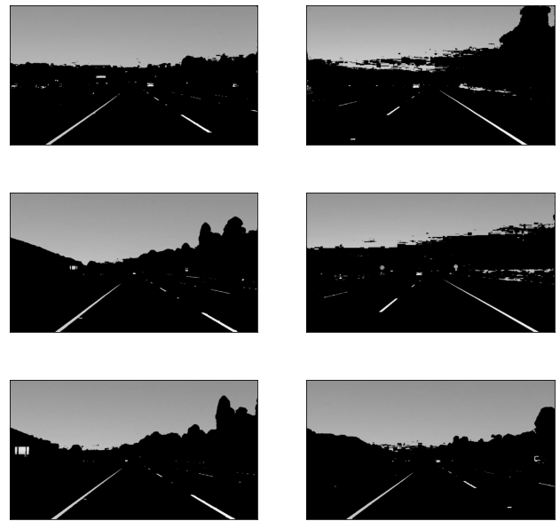
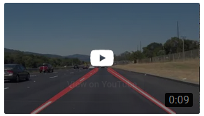

# Finding Lane Lines on the Road
[](https://youtu.be/KHMm9bNizo8)

## Introduction
In this project we are going to detect lane line on the road. Inputs were provided as a video clips and annotations were done with provided input road images. Our goal to detect lane line using annotated road images. Following learning objectives will be covered from this projects.

* Basic usage of OpenCV Python APIs
* Basic image processing techniques such as colour scale changes, colour selection, bluring images
* Images edge detection using Canny edge detector (OpenCV will be used to apply these theories)
* Required images' region selection. Both hard coded and dynamic selections will be used
* Hough tranfomation line detection (OpenCV will be used to appy these alogorithnms)

This project consits of following major files and folders.
* Finding_Lane_Lines_on_the_Road.ipynb - **The IPython notebook file**
* Finding_Lane_Lines_on_the_Road.html - **A extracted HTML file from notebook**
* READMED.md - **Writeup for this project**
* test_images - **Test images directory**
* test_videos - **Test videos directory**
* test_videos_output - **Output directory**
* opencv - **Sample OpenCV works**
* resources - **Required images for writeup**
* requirements,txt - **Python dependencies** 

[Running Instruction](HOW_TO_RUN.md)

## Loading Test Images
**matplotlib** was used to visualize provided and generated test image. Following are the provided test iamges.


## Image Processing
### Colour selection
Lines are yellow and white, some are dotted lines. Dotted lines need to be detected as a single line. Images were loaded as RGB spaces. In OpenCV `cv2.inRange` function can be used to mask images with different colours. [Colour flickers or Colour chart](https://www.rapidtables.com/web/color/RGB_Color.html) can be used to pick specific colours. Following fucntion is used filter yellow and white parts from the images.
```python
def select_rgb_white_yellow(img):
    # white mask
    lower_bound = np.uint8([220,220,220])
    upper_bound = np.uint8([255,255,255])
    w_mask = cv2.inRange(img, lower_bound, upper_bound)

    # yellow masked
    lower_bound = np.uint8([190, 190,0])
    y_mask = cv2.inRange(img, lower_bound, upper_bound)

    # combine the masks
    mask = cv2.bitwise_or(w_mask, y_mask)
    return cv2.bitwise_and(img, img,mask=mask)
```
Following are the results after applying above filter  


### Select different colour space using OpenCV
As an example, I used to show HSV colour space and used OpenCV `cv2.COLOR_RGB2HSV` colour code.

#### How HSV and HSL colour spaces are working?
* H- Hue: Hue is a degree on the color wheel from 0 to 360. 0 is red, 120 is green, 240 is blue.
* S- Saturation: Saturation is a percentage value; 0% means a shade of gray and 100% is the full color.
* L - Lightness: Lightness is also a percentage; 0% is black, 100% is white.

 

Image was croped: https://en.wikipedia.org/wiki/HSL_and_HSV  

##### HSV filter
```python
def rgb_to_hsv(img):
    return cv2.cvtColor(img, cv2.COLOR_RGB2HSV)
```  

Following are the results after applying HSV filter  

 

##### HSL filter
```python
def rgb_to_hsv(img):
    return cv2.cvtColor(img, cv2.COLOR_RGB2HLS)
```   
Following are the results after applying HSL filter  


Compare with both filters, the HSL filter is good to detect both white and yellow lane lines  

##### Select white and yellow colour spaces using HSL filter

```python
def select_white_yellow(img):
    # convert RGB colour space to HSL colour space
    converted_img = rgb_to_hsl(img)
    # white colour mask
    lower_bound = np.uint8([0, 200, 0])
    upper_bound = np.uint8([255, 255, 255])
    w_mask = cv2.inRange(converted_img, lower_bound, upper_bound)
    # yellow colour mask
    lower_bound = np.uint8([10, 0, 100])
    y_mask = cv2.inRange(converted_img, lower_bound, upper_bound)

    # combine the mask
    mask = cv2.bitwise_or(w_mask, y_mask)
    return cv2.bitwise_and(img, img, mask=mask)
    
```

Following are the results after applying combine HSL filter and colour masked filter.  


## Edge Detection
Upto now we have used some functions to do some image processing techniques to prepare our test images for further image processing. Now we'll extract edges using  some advanced algorithms like Canny edge detection, Hough transformation. Here we'll use OpenCV inbuilt functions to apply these algorithmns. Following steps will be used to detect edges from images.  

* Step01 - Grayscaling preared images
* Step02 - Applying Gaussian filter to smooth gray scaled images
* Step03 - Canny edge detection from smoothed images
* Step04 - Hough tranfomation to detect lines from Canny edge detected images


### Grayscaling images
To grayscale images OpenCV `cv2.cvtColor` function is used with the OpenCV `COLOR_RGB2GRAY` colour code. Following utility function will be used in our pipeline.

```python
def grayscale(img):
    """
    This function is used to convert RGB images to gray scale iamges
    :param img: input image
    :return: gray scaled image
    """
    return cv2.cvtColor(img, cv2.COLOR_RGB2GRAY)
```

After applying above grayscale filter for prepared images, following are the results.  



### Smoothing grayscaled images using Gaussian Smoothing
We'll apply OpenCV `cv2.GaussianBlur` function to smooth our grayscaled images.  

```python
def grayscale(img):
    """
    This function is used to convert RGB images to gray scale iamges
    :param img: input image
    :return: gray scaled image
    """
    return cv2.cvtColor(img, cv2.COLOR_RGB2GRAY)
```

Following are the results, after applying **GaussianBlur**.


### Detecting edges using Canny edge detector
Now we'll apply Canny edge detection for smoothed images. Following is the utility fuction that is used to detect edges from images.

```python
def detect_edges(img, low_threshold = 50, high_threshold=150):
    """
    This utility function is used to detect edges from input images
    :param img:
    :param low_threshold:
    :param high_threshold:
    :return: A gray scaled image only with edges
    """
    return cv2.Canny(img,low_threshold, high_threshold)
    
 ```
 
Following are the results of Canny edge detector.


### Hough tranfomation for line detection
We have detected edges using Canny edge detector algorithm. Now we have to select our interest areas from images to apply Hough trasformation.

#### Select region of interest
This is the most tricky part in this pipeline building. Since we are going to detect road lane left and right lines which are bounded with vehicle front, we have to select area that is fitted with our requirements. I have manually marked our final results, before we going to do it programatically :). Following are the manual marked images.


OpenCV `cv2.fillPoly` was used to select a polygon to caputure our interest ares. Following are the functions used to select interested regions.

```python
def region_of_interest(img, vertices):
    """
    Applies an image mask.

    Only keeps the region of the image defined by the polygon
    formed from `vertices`. The rest of the image is set to black.
    `vertices` should be a numpy array of integer points.
    """
    #defining a blank mask to start with
    mask = np.zeros_like(img)

    #defining a 3 channel or 1 channel color to fill the mask with depending on the input image
    if len(img.shape) > 2:
        channel_count = img.shape[2]  # i.e. 3 or 4 depending on your image
        ignore_mask_color = (255,) * channel_count
    else:
        ignore_mask_color = 255

    #filling pixels inside the polygon defined by "vertices" with the fill color
    cv2.fillPoly(mask, vertices, ignore_mask_color)

    #returning the image only where mask pixels are nonzero
    masked_image = cv2.bitwise_and(img, mask)
    return masked_image
```
```python
def select_region(img):
    """
    This is used to select an interest region. Here our major interest points are left lane line and right lane line
    :param img:
    :return: Seleted region as a gray scaled edge image
    """
#     imshape = img.shape
    # Initial vertices selection with hard coded pixels
    # vertices = np.array([[(0,imshape[0]),(450, 290), (490, 290), (imshape[1],imshape[0])]], dtype=np.int32)
    
    # Improved version of vertices selection with dyanamic ratios
    height,width = img.shape[:2]
    bottom_left = [width*0.1 , height*0.95]
    top_left = [width*0.4 , height * 0.6]
    bottom_right = [width * 0.9, height * 0.95]
    top_right = [width * 0.6, height * 0.6]
    vertices = np.array([[bottom_left, top_left, top_right, bottom_right]], dtype=np.int32)
    return region_of_interest(img, vertices)
```

After applying above functions for Canny detected images, following results were extracted.


#### Applying Hough line transformation
`cv2.HoughLinesP` was used to Hough tranfomation. More theories can be found with this [wikipedia link](https://en.wikipedia.org/wiki/Hough_transform). Following function was used to do Hough transform.

```python
def hough_lines(image):
    """
    `image` should be the output of a Canny transform.

    Returns hough lines (not the image with lines)
    """
    return cv2.HoughLinesP(image, rho=1, theta=np.pi/180, threshold=20, minLineLength=20, maxLineGap=300)
```

After Hough line trasformation, lines were drawn using following function.

```python
def draw_lines(img, lines, thickness=2, make_copy=True):
    # the lines returned by cv2.HoughLinesP has the shape (-1, 1, 4)
    if make_copy:
        img = np.copy(img) # don't want to modify the original
    for line in lines:
        for x1,y1,x2,y2 in line:
            cv2.line(img, (x1, y1), (x2, y2), [255, 0, 0], thickness)
    return img
    
```

Final results with drawn lines.


After the chain of steps, our pipeline is ready to detect lane lines from road images. But pipeline is not good enough to go next steps. After applying this pipeline for a separate unit test following things were noticed. 


### Optimazation and improvements for draw lines

#### Averaging lane lines
We can see there are mutiple lines detected for a lane line. In our case multiple lane lines are not good to proceed. We should come up with an averaged line for that.

#### Extrapolation lane lines
Since we are expecting an angular left and right lines, slope of the left must positive and slope of the right must negative. And, there are lane lines not detected fully. Therefore we should extrapolate the line to cover full lane length.  

Following utility functions will be used to do averagin and extrapolation.

```python
def average_slope_intercept(lines):
    left_lines    = [] # (slope, intercept)
    left_weights  = [] # (length,)
    right_lines   = [] # (slope, intercept)
    right_weights = [] # (length,)
    
    for line in lines:
        for x1, y1, x2, y2 in line:
            if x2==x1:
                continue # ignore a vertical line
            
            # Y = mX + b
            slope = (y2-y1)/(x2-x1) # m
            intercept = y1 - slope*x1 # b
            length = np.sqrt((y2-y1)**2+(x2-x1)**2)
            if slope < 0: # y is reversed in image
                left_lines.append((slope, intercept))
                left_weights.append((length))
            else:
                right_lines.append((slope, intercept))
                right_weights.append((length))
    
    # add more weight to longer lines    
    left_lane  = np.dot(left_weights,  left_lines) /np.sum(left_weights)  if len(left_weights) >0 else None
    right_lane = np.dot(right_weights, right_lines)/np.sum(right_weights) if len(right_weights)>0 else None
    
    return left_lane, right_lane # (slope, intercept), (slope, intercept)
    
```

Using average_slope_intercept function, we can calculate average slope and intercept for the left lane and right lane. To draw the lanes, slope and intecept neet to be converted into pixel values.

```python
def make_line_points(y1, y2, line):
    """
    Convert a line represented in slope and intercept into pixel points
    """
    if line is None:
        return None
    
    slope, intercept = line
    
    # make sure everything is integer as cv2.line requires it
    x1 = int((y1 - intercept)/slope)
    x2 = int((y2 - intercept)/slope)
    y1 = int(y1)
    y2 = int(y2)
    
    return ((x1, y1), (x2, y2))
    
```
```python
def lane_lines(image, lines):
    left_lane, right_lane = average_slope_intercept(lines)
    
    y1 = image.shape[0] # bottom of the image
    y2 = y1*0.6         # slightly lower than the middle

    left_line  = make_line_points(y1, y2, left_lane)
    right_line = make_line_points(y1, y2, right_lane)
    
    return left_line, right_line
```
```python 
def draw_lane_lines(image, lines, color=[255, 0, 0], thickness=20):
    # make a separate image to draw lines and combine with the orignal later
    line_image = np.zeros_like(image)
    for line in lines:
        if line is not None:
            cv2.line(line_image, *line,  color, thickness)
    # image1 * α + image2 * β + λ
    # image1 and image2 must be the same shape.
    return cv2.addWeighted(image, 1.0, line_image, 0.95, 0.0)
```
After the averaging and extrapolation the images are gave the following results.


## Build Pipeline and Test with Video Clips
Now we have required utility functions to build lane lines ob the roads. Following functions were implemented to build this pipeline.

```python
def mean_line(line, lines):
    if line is not None:
        lines.append(line)

    if len(lines)>0:
        line = np.mean(lines, axis=0, dtype=np.int32)
        line = tuple(map(tuple, line)) # make sure it's tuples not numpy array for cv2.line to work
    return line
```
```python
def process_image(img):
    """
    This is used to build our road lane line detect pipeline
    :param imag -
    """
    w_y_img = select_white_yellow(img) # Extracted white-yellow image
    gray_img = grayscale(w_y_img) # gray scaled iamge
    smooth_gray = apply_smoothing(gray_img) # Gaussian smoothing image
    edges = detect_edges(smooth_gray) # Canny edge detected iamge
    roi_img = select_region(edges) # selected rion image
    lines = hough_lines(roi_img) # Hough transformed iamge
    l_line , r_line = lane_lines(img, lines) # separated left and right lane lines

    l_line = mean_line(l_line, deque(maxlen=50)) # apply averaging and extract single line left lane line
    r_line = mean_line(r_line, deque(maxlen=50)) # appy averaging and extract single line right lane line

    return draw_lane_lines(img, (l_line, r_line)) # draw lane line and return lane line drawn iamge
    
```
```python
def detect_lanes_from_video(input_path, output_path):
    clip1 = VideoFileClip("test_videos/"+input_path)
    white_clip = clip1.fl_image(process_image) #NOTE: this function expects color images!!
    white_clip.write_videofile(out_dir+output_path, audio=False)
    return white_clip
```
### Sample test case for `solidYellowLeft.mp4`

```python
out_name = "solidYellowLeft.mp4"
out_video = out_dir+out_name
%time out_vedio = detect_lanes_from_video(out_name,out_name)
```
## Results
Output videos can be found [](test_videos_output/) or with the following links.  

Solid Yellow Left -  

[](https://youtu.be/KHMm9bNizo8) 

Solid White Right -  

[](https://youtu.be/jqXXYEpGqfg)  

Challenge Clip - 

[](https://youtu.be/FQlkyQmXtiI)

## Indentified Protential Shortcommings
* 
*

## Suggest Improvements
*
*

## References
* [Introduction to Computer Vision - Udacity](https://www.udacity.com/course/introduction-to-computer-vision--ud810)
* [Self driving can engineer - Udacity](https://www.udacity.com/course/self-driving-car-engineer-nanodegree--nd013)
* [OpenCV official documents](https://docs.opencv.org/4.4.0/index.html)
* [OpenCV my git repo C++ samples](https://github.com/snandasena/opencv-cpp-examples)
* [Canny edge detection](https://en.wikipedia.org/wiki/Canny_edge_detector)
* [Hough tranform](https://en.wikipedia.org/wiki/Hough_transform)
* [Gaussian blur](https://en.wikipedia.org/wiki/Gaussian_blur)
* [Naoki medium blog](https://naokishibuya.medium.com/finding-lane-lines-on-the-road-30cf016a1165)
* [HSV and HSL](https://www.w3schools.com/colors/colors_hsl.asp)

## Acknowledgments
Big thank you to [Udacity](https://www.udacity.com) for providing the template code for this project.
